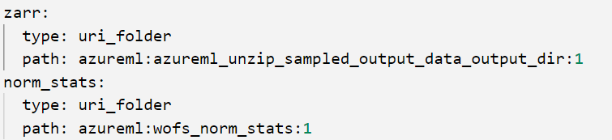
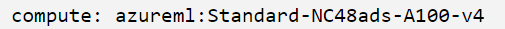
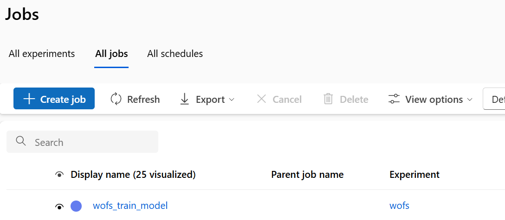
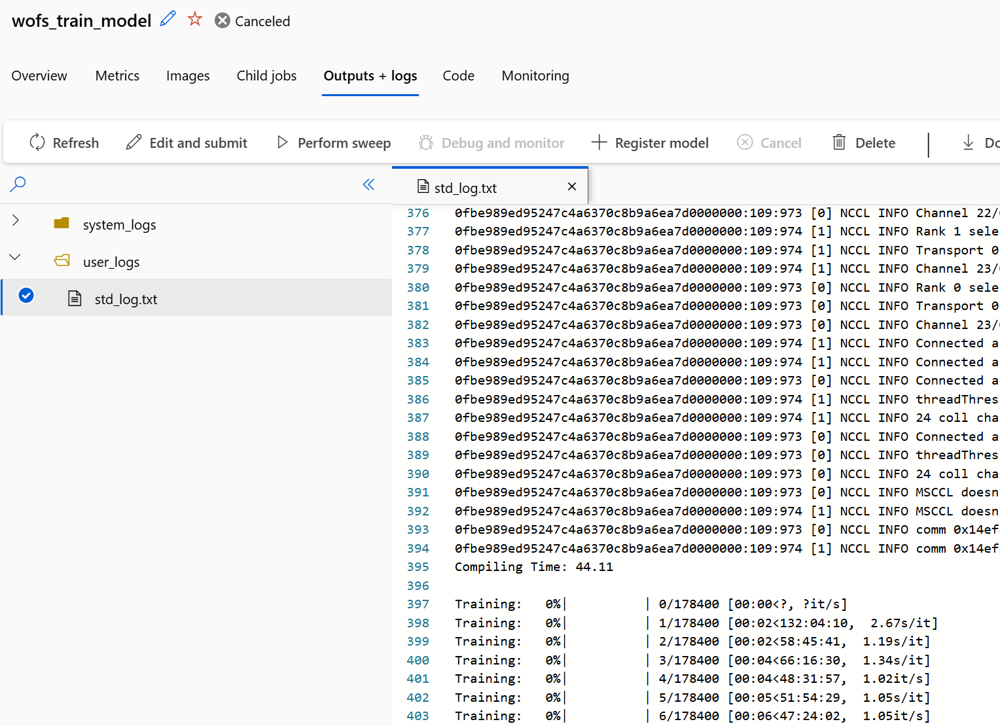

# WOFS Model training in AML

This example shows some of the steps required to train the base WOFS weather model.

The example is comprised of the following sections:
- wofs_docker_env -- Docker environment configuration 
- src -- directory containing the AML job definition .yaml and a placeholder (src) for WOFS python code  
- Wofs_Training_Job.ipynb -- jupyter notebook acting as a driver entry point for AML environment setup and job initiation

## AML Environment Setup for WOFS

WOFS requires a set of specific python dependencies.  

To create the appropriate AML environment, execute Steps 1 and 2 in the Wofs_Training_Job.ipynb notebook.  These commands will set up the local execution environment and start an AML environment build job in AML

## Provide WOFS implementation

Next step is to provide the source code and packages that implement WOFS.

At a minimum, copy <your_wofs_repo_location>/wofscast and <your_wofs_repo_location>/workflow to /src 
Resulting structure should look like the following:
- /src
  - your_wofs_source_code_goes_here.placeholder
  - wofscast
  - workflow

## Update AML Job YAML

Update the YAML definition in Step 3 of the included Wofs_Training_Job.ipynb to point to the approriate AML Data Assets:

Update the compute name to point to a valid compute cluster in your environment:

## Submit the job configuration to AML

Execute Step 3 in the included Wofs_Training_Job.ipynb

## Monitor job progress in AML

Job may now be observed AML Workspace portal:

Job progress may be viewed in the output logs:

